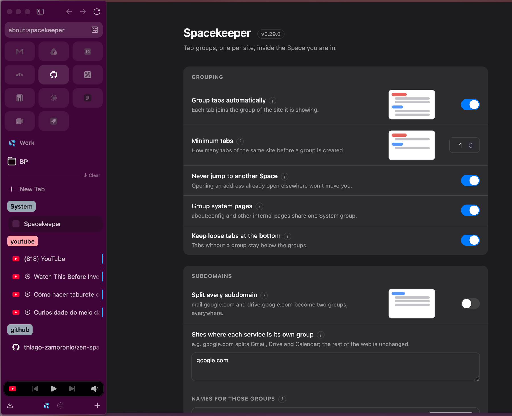
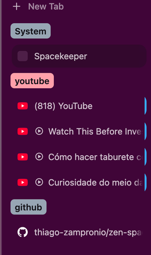
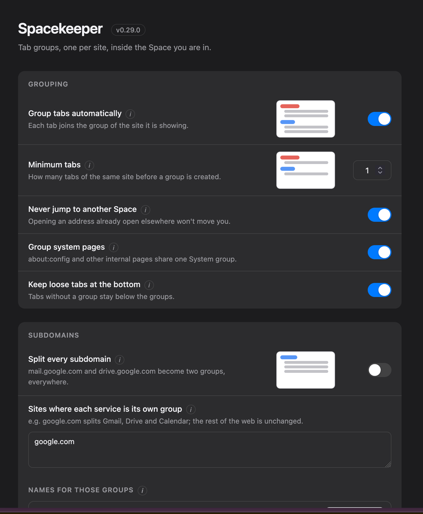

# Spacekeeper — automatic tab groups for Zen Browser

**Tab groups, one per site, inside the Space you are in.**

Spacekeeper organizes your tabs into groups **automatically, by site, as you
browse** — built for the **Zen Browser** and aware of its **Spaces** (workspaces)
in a way no extension can be. A `youtube` group in your "Personal" Space and a
`youtube` group in your "Work" Space are independent groups, and **no tab is ever
dragged out of the Space you put it in**.

<p align="center">
  
</p>
<p align="center"><em>Groups appear in the sidebar as you browse; everything is configured in <code>about:spacekeeper</code>.</em></p>

## Install in one command

**macOS and Linux**, in a terminal:

```sh
curl -fsSL https://raw.githubusercontent.com/thiago-zampronio/zen-spacekeeper/main/install.sh | sh -s -- --guard --restart
```

**Windows**, in PowerShell:

```powershell
& ([scriptblock]::Create((irm https://raw.githubusercontent.com/thiago-zampronio/zen-spacekeeper/main/install.ps1))) -Guard -Restart
```

It detects Zen and your profile, installs everything, restarts with the startup
cache cleared, and leaves a guard that survives Zen updates. Every flag, the
read-it-first path and the fine print live in the
[manual](docs/MANUAL.md#installation).

## What you get



- **Automatic tab grouping** — tabs group themselves by site the moment they
  open; navigate from GitHub to YouTube and the tab changes group on its own.
- **Spaces as a hard boundary** — organizing never moves a tab across workspaces.
  This is the gap Spacekeeper exists to fill: the WebExtensions API cannot see
  Spaces, so extensions like Auto Tab Groups drag tabs between them.
- **Group colors from favicons** — YouTube turns red and GitHub turns gray on
  their own; a color you pick by hand is remembered.
- **A System group for browser pages** — `about:config`, settings and other
  internal pages share one tidy group per Space instead of littering the sidebar.
- **Loose tabs stay findable** — tabs without a group settle below the groups,
  never wedged between them.
- **Focus mode** — keeps only the groups you are actually using expanded, so a
  long sidebar stays readable.
- **Stay in your Space** — typing an address that is already open in another
  Space no longer teleports you there.
- **A real control panel** — `about:spacekeeper`, every setting explained in
  plain language, no JSON editing. English, Portuguese and Spanish.
- **Respects your organization** — pinned tabs, essential tabs, Zen folders,
  split view and groups you made by hand are never touched.
- **Private by design** — no telemetry, everything stays on your machine, and the
  only action that ever contacts the network is the update you explicitly click.
- **Takes care of itself** — an optional guard restores the loader when a Zen
  update deletes it (or tells you, within seconds); updates and uninstall are one
  click inside the panel.

<br clear="all">

## Set it up in plain language

<p align="center">
  
</p>
<p align="center"><em>Every setting explained in one sentence — no JSON, no about:config required.</em></p>

Open **`about:spacekeeper`**: grouping, subdomains, custom rules, exclusions,
appearance, focus mode, diagnostics — plus updating and uninstalling, one click
each. Power users get the same settings as raw `zen.stg.*` preferences, all
documented in the [manual](docs/MANUAL.md#configuration).

## When Zen updates

Every Zen update deletes the loader this mod depends on — that is life for every
userscript. Spacekeeper is the one that handles it: the optional **guard** notices
within seconds and restores the loader or notifies you with the exact next step,
and even without it, re-running the install one-liner puts everything back. The
full story is in the [manual](docs/MANUAL.md#after-every-zen-update).

## Why a userscript, and not an extension or a Zen Mod

Spacekeeper is a **userscript** — a privileged chrome script (`.uc.mjs`) loaded by
fx-autoconfig. That is the same category as the scripts people install through
[Sine](https://github.com/CosmoCreeper/Sine), and it is deliberately not one of
the other two:

| | Extension (`.xpi`) | Zen Mod | Userscript (this) |
| --- | --- | --- | --- |
| Runs JavaScript | yes, sandboxed | **no** | yes, privileged |
| Sees Spaces | **no** | n/a | yes |
| Installation | `about:addons` | mod store | one command |

The WebExtensions API does not expose Spaces, and Zen Mods run no JavaScript at
all. What is left is a privileged chrome script, and the project treats that
privilege seriously: no network at runtime, a living specification, and every
requirement anchored in the code by an automated check.

## Problems?

Open an issue at
[github.com/thiago-zampronio/zen-spacekeeper/issues](https://github.com/thiago-zampronio/zen-spacekeeper/issues)
with the version (`ZSTG.version` in the console, or the panel header), the result
of `ZSTG.selfTest()`, and — if the problem involves grouping decisions — the
relevant lines of `zstg-debug.log` after turning `zen.stg.debugLog` on and
reproducing it.

## The manual

Everything deeper lives in **[docs/MANUAL.md](docs/MANUAL.md)**: the full
preference table, commands and shortcuts, diagnostics and the debug log, how the
guard works, appearance tuning, the manual verification checklist, known
limitations, and the project's structure. The behavior itself is specified in
[`openspec/specs/`](openspec/specs/) — one file per capability, every requirement
anchored in the code.

## License

MIT — see [LICENSE](LICENSE). Third-party code is listed in [NOTICE](NOTICE):
`vendor/fx-autoconfig/` is a vendored copy under MPL 2.0 and keeps its own
license.
